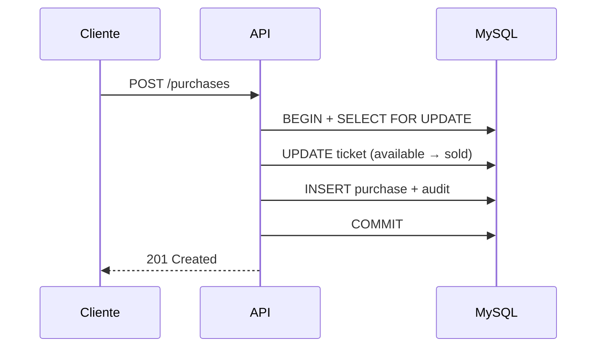

# Ticket Sales API

> API REST de venda de ingressos com **transações MySQL**, **controle de concorrência**, reservas com expiração automática, audit logs e evolução incremental para **Clean Architecture**.

[](https://nodejs.org/)
[](https://www.typescriptlang.org/)
[](https://expressjs.com/)
[](https://www.mysql.com/)
[](https://vitest.dev/)
[](https://www.docker.com/)
[](https://ticket-sales-3su2.onrender.com/docs/)
[]()

---

## 🚀 Demonstração Online

A API está **publicada e acessível**. Explore a documentação interativa e teste os endpoints diretamente no navegador.

### Swagger

**https://ticket-sales-3su2.onrender.com/docs/**

Documentação OpenAPI pública — sem autenticação. Use **Authorize** com `Bearer <token>` após o login para testar rotas protegidas.

### API Base URL

**https://ticket-sales-3su2.onrender.com**

```bash
# Health check
curl https://ticket-sales-3su2.onrender.com/health

# Readiness
curl https://ticket-sales-3su2.onrender.com/ready
```

---

## 👩‍💻 Sobre o Projeto

**Ticket Sales** é uma API REST para gerenciamento e venda de ingressos desenvolvida com Node.js, TypeScript, Express e MySQL, aplicando conceitos de transações, concorrência, autenticação JWT, testes automatizados, Docker e evolução arquitetural.

O sistema conecta **parceiros** (organizadores de eventos) e **clientes** (compradores) em um fluxo completo de ticketing — da criação de eventos à compra e cancelamento de ingressos — com garantias de integridade em cenários concorrentes.

**Ciclo de vida do ticket:**

```
available → reserved → sold
     ↑         │         │
     └─────────┴─────────┘
   (expiração / cancelamento)
```

---

## ✨ Principais Funcionalidades

| Funcionalidade                 | Descrição                                    |
| ------------------------------ | -------------------------------------------- |
| 🔐 **Autenticação JWT**        | Login seguro para partners e customers       |
| 🤝 **Cadastro de parceiros**   | Organizadores criam eventos e tickets        |
| 👤 **Cadastro de clientes**    | Compradores reservam e compram ingressos     |
| 🎫 **Gestão de eventos**       | CRUD por partner + listagem pública          |
| 🎟️ **Criação de ingressos**    | Tickets em lote com preço e status           |
| ⏳ **Reserva de ingressos**    | Bloqueio temporário (5 minutos)              |
| 💳 **Compra de ingressos**     | Venda transacional com `card_token`          |
| ↩️ **Cancelamento de compras** | Restaura tickets para `available`            |
| ⏰ **Expiração automática**    | Job libera reservas vencidas a cada 60s      |
| 📊 **Histórico de status**     | `ticket_status_history` por ticket           |
| 📝 **Audit Logs**              | Rastreabilidade de ações de negócio          |
| 📖 **Swagger / OpenAPI**       | Documentação interativa em `/docs`           |
| 🐳 **Docker**                  | Compose com API + MySQL                      |
| ✅ **Testes automatizados**    | Unitários, integração e E2E (~86% cobertura) |

Regras detalhadas: [docs/business-rules.md](docs/business-rules.md)

---

## 🏗 Arquitetura

Evolução incremental para **Clean Architecture** (Strangler Fig Pattern) — sem reescrita total, preservando contratos HTTP.

```text
HTTP Request
    ↓
Controllers        → entrada HTTP, validação, status codes
    ↓
Factories          → composition root (wiring de dependências)
    ↓
Use Cases          → regras de negócio (application layer)
    ↓
Repositories       → ports (interfaces) + adapters MySQL (infra)
    ↓
Models + MySQL     → persistência (Active Record encapsulado)
```

| Camada          | Papel                                                |
| --------------- | ---------------------------------------------------- |
| **Controllers** | Rotas Express, auth de perfil, mapeamento HTTP       |
| **Services**    | Facades finos + `EventService.getHistory` (legado)   |
| **Use Cases**   | Orquestração transacional sem SQL direto             |
| **Models**      | Acesso MySQL; encapsulados por repositories          |
| **Jobs**        | Expiração automática de reservas (`setInterval` 60s) |
| **MySQL**       | Transações, `FOR UPDATE`, histórico e audit          |

**Módulos migrados:** Reservations · Purchases · Tickets · Events · Identidade

Documentação completa: [docs/architecture.md](docs/architecture.md) · [docs/interview-guide.md](docs/interview-guide.md)

---

## 🔒 Aspectos Técnicos

| Aspecto                      | Implementação                                                     |
| ---------------------------- | ----------------------------------------------------------------- |
| **Transações MySQL**         | `BEGIN` / `COMMIT` / `ROLLBACK` em reserva, compra e cancelamento |
| **Controle de concorrência** | `SELECT FOR UPDATE` + `UPDATE WHERE status = 'available'`         |
| **Reserva temporária**       | Tickets bloqueados por 5 min; expiração automática                |
| **Rollback em falhas**       | Operação atômica — nenhuma alteração parcial persiste             |
| **JWT Authentication**       | bcrypt + token `{ id, email }` com expiração de 1h                |
| **Logs de auditoria**        | `audit_logs` gravados na mesma transação da operação              |

---

## 🧪 Testes

| Nível                 | Escopo                                    | Comando         |
| --------------------- | ----------------------------------------- | --------------- |
| **Unit Tests**        | Use cases, repositories, mappers, domain  | `pnpm test`     |
| **Integration Tests** | Controllers HTTP com Supertest + mocks    | `pnpm test`     |
| **E2E Tests**         | Fluxo completo com MySQL real (15 testes) | `pnpm test:e2e` |

```bash
# Suíte principal (331 testes — sem MySQL)
pnpm test

# Cobertura (~86%; metas ≥ 80%)
pnpm test:coverage

# E2E — requer MySQL rodando
pnpm test:e2e

# Pipeline local completa
pnpm check
```

---

## 🐳 Executando com Docker

```bash
# Subir API + MySQL
docker compose up -d

# Apenas MySQL (dev local)
docker compose up -d mysql && pnpm dev

# Health check
curl http://localhost:3000/health
```

| Serviço | Container          | Porta |
| ------- | ------------------ | ----- |
| API     | `ticket-sales-api` | 3000  |
| MySQL   | `ticket-sales-db`  | 3307  |

Reset do banco: `docker compose down -v && docker compose up --build -d`

---

## ⚡ Início Rápido (local)

```bash
git clone https://github.com/vivianeaguiarc/ticket-sales.git
cd ticket-sales
pnpm install
cp .env.example .env
docker compose up -d mysql
pnpm dev
```

Fluxo manual: abra [`api.http`](api.http) e execute os passos **0 → 12**.

---

## 📡 Endpoints

### Exemplos

```http
GET  /health
POST /auth/login
POST /partners/register
POST /partners/events
POST /partners/events/:eventId/tickets
POST /partners/events/reservations      # { "ticket_ids": [1, 2] }
POST /partners/events/purchases         # { "ticket_ids": [3], "card_token": "..." }
POST /partners/events/purchases/:id/cancel
GET  /docs
```

### Referência completa

| Método | Rota                                    | Auth | Descrição                  |
| ------ | --------------------------------------- | ---- | -------------------------- |
| GET    | `/health`                               | Não  | Health check (API + MySQL) |
| GET    | `/ready`                                | Não  | Readiness                  |
| POST   | `/auth/login`                           | Não  | Login → JWT                |
| POST   | `/partners/register`                    | Não  | Cadastro parceiro          |
| POST   | `/customers/register`                   | Não  | Cadastro cliente           |
| GET    | `/events`                               | Não  | Listar eventos (público)   |
| POST   | `/partners/events`                      | Sim  | Criar evento               |
| GET    | `/partners/events`                      | Sim  | Eventos do parceiro        |
| GET    | `/partners/events/:eventId/history`     | Sim  | Histórico do evento        |
| POST   | `/partners/events/:eventId/tickets`     | Sim  | Criar tickets              |
| GET    | `/partners/events/:eventId/tickets`     | Sim  | Listar tickets             |
| POST   | `/partners/events/reservations`         | Sim  | Reservar tickets           |
| POST   | `/partners/events/purchases`            | Sim  | Comprar tickets            |
| POST   | `/partners/events/purchases/:id/cancel` | Sim  | Cancelar compra            |
| GET    | `/docs`                                 | Não  | Swagger UI                 |

---

## ☁️ Deploy no Render

A API em produção está hospedada no [Render](https://render.com):

- **Swagger:** https://ticket-sales-3su2.onrender.com/docs/
- **API:** https://ticket-sales-3su2.onrender.com

### Configuração (novo deploy)

| Campo             | Valor                        |
| ----------------- | ---------------------------- |
| **Build Command** | `pnpm install && pnpm build` |
| **Start Command** | `pnpm start`                 |
| **Health Check**  | `/health`                    |

Blueprint automático: [`render.yaml`](render.yaml)

Variáveis obrigatórias: `NODE_ENV`, `HOST`, `DB_*`, `JWT_SECRET`. Aplique `db.sql` no MySQL antes do primeiro uso.

---

## 📚 Documentação Técnica

| Documento                                          | Conteúdo                      |
| -------------------------------------------------- | ----------------------------- |
| [docs/architecture.md](docs/architecture.md)       | Camadas, migração, trade-offs |
| [docs/business-rules.md](docs/business-rules.md)   | Regras de domínio             |
| [docs/interview-guide.md](docs/interview-guide.md) | Roteiro para entrevistas      |
| [api.http](api.http)                               | Fluxo HTTP manual             |

---

## 🗂 Estrutura do Projeto

```text
src/
├── domain/         # Entidades, erros, ports
├── application/    # Use cases
├── infra/          # Repositories, JWT, factories
├── controller/     # Rotas HTTP
├── services/       # Facades finos
├── use-cases/      # Legado (ticket-controller + job)
├── models/         # Persistência MySQL
├── jobs/           # Expiração de reservas
└── e2e/            # Testes E2E
```

---

## 📊 Status do Projeto

| Área                                               | Status |
| -------------------------------------------------- | ------ |
| Domínio completo (reserva / compra / cancelamento) | ✅     |
| Concorrência + transações                          | ✅     |
| Testes + E2E + cobertura                           | ✅     |
| Docker + deploy Render                             | ✅     |
| Swagger público em produção                        | ✅     |
| Clean Architecture (5 módulos)                     | ✅     |
| CI/CD · Rate limit · CORS · Helmet                 | 🔜     |

---

## 📈 Diagrama — Compra Transacional



---

## 👤 Autora

**Viviane Aguiar** — Backend Developer · Node.js · TypeScript

- LinkedIn: [linkedin.com/in/vivianeaguiarc](https://www.linkedin.com/in/vivianeaguiarc/)
- Email: [vivianeaguiarc@outlook.com](mailto:vivianeaguiarc@outlook.com)
- Demo: [ticket-sales-3su2.onrender.com/docs](https://ticket-sales-3su2.onrender.com/docs/)

## Licença

ISC
