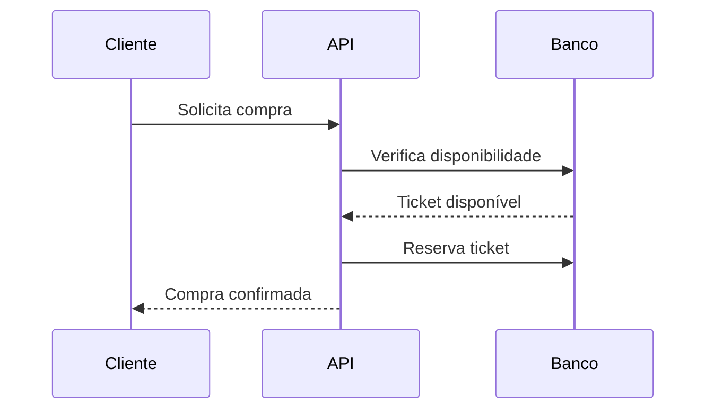

# 🎟️ Ticket Sales API

API REST robusta para **criação, gerenciamento e venda de ingressos para eventos**, projetada com foco em **escalabilidade, concorrência e boas práticas de engenharia de software** 🚀

---

## 📌 Visão Geral

O sistema permite:

- 🧑‍💼 Parceiros criarem eventos
- 🎫 Gerenciamento de tickets por lote
- 🛒 Clientes comprarem ingressos
- ❌ Cancelamento de compras
- 📊 Controle de concorrência (evita vendas duplicadas)
- ⚡ Alta escalabilidade para milhares de acessos simultâneos

---

## 🧠 Regras de Negócio

### 🎟️ Gerenciamento de Tickets

- Apenas o parceiro criador pode gerenciar tickets
- Tickets são criados em lote
- Status inicial: **disponível**

### 🛒 Compra de Tickets

- Cliente pode comprar múltiplos tickets
- Um ticket só pode ser comprado uma vez (controle de concorrência)
- Falhas de compra são registradas

### ❌ Cancelamento

- Tickets retornam para "disponível"
- Histórico de status é mantido

### ⚡ Escalabilidade

- Sistema preparado para alta concorrência

---

## 🧱 Entidades do Sistema

### 👨‍💼 Parceiros

```ts
id: string
nome: string
email: string
senha: string
empresa: string
```

### 👤 Clientes

```ts
id: string
nome: string
email: string
senha: string
endereco: string
telefone: string
```

### 🎉 Eventos

```ts
id: number
nome: string
descricao: string
data: Date
local: string
parceiro_id: string
```

### 🎫 Tickets

```ts
id: number
evento_id: number
local: string
preco: number
status: 'disponivel' | 'vendido'
```

---

## 🏗️ Arquitetura

Projeto baseado em:

- 🧩 Clean Architecture
- 🔌 Arquitetura Hexagonal
- ♻️ SOLID Principles

### 📂 Estrutura

```
src/
 ├── main/
 ├── modules/
 ├── shared/
 ├── infra/
 └── application/
```

---

## 🛠️ Tecnologias

| Tecnologia        | Descrição               |
| ----------------- | ----------------------- |
| Node.js 24        | Runtime                 |
| TypeScript        | Tipagem forte           |
| Express 5         | API REST                |
| Prisma            | ORM                     |
| PostgreSQL        | Banco de dados          |
| Vitest            | Testes                  |
| ESLint + Prettier | Qualidade de código     |
| Husky             | Git hooks               |
| Commitlint        | Padronização de commits |

---

## ⚙️ Scripts

```bash
pnpm dev
pnpm build
pnpm start
pnpm test
pnpm lint
pnpm format
pnpm check
```

---

## 🔁 Fluxo de Compra



---

## 🚀 Diferenciais

- ⚡ Controle de concorrência
- 🧱 Arquitetura escalável
- 🧪 Testes automatizados
- 🔍 Código limpo e padronizado
- 📈 Pronto para produção

---

## 📈 Próximos passos

- 🔐 Autenticação JWT
- 💳 Integração com pagamentos
- 📊 Dashboard de vendas
- ☁️ Deploy em cloud

---

## 👩‍💻 Autora

**Viviane Aguiar**  
💻 Backend Developer | Node.js | TypeScript | Clean Architecture

---

## ⭐ Se este projeto te chamou atenção

Deixe uma ⭐ no repositório e acompanhe a evolução 🚀
