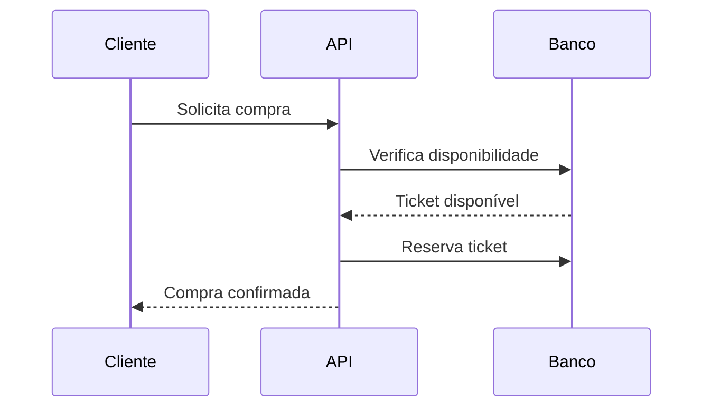
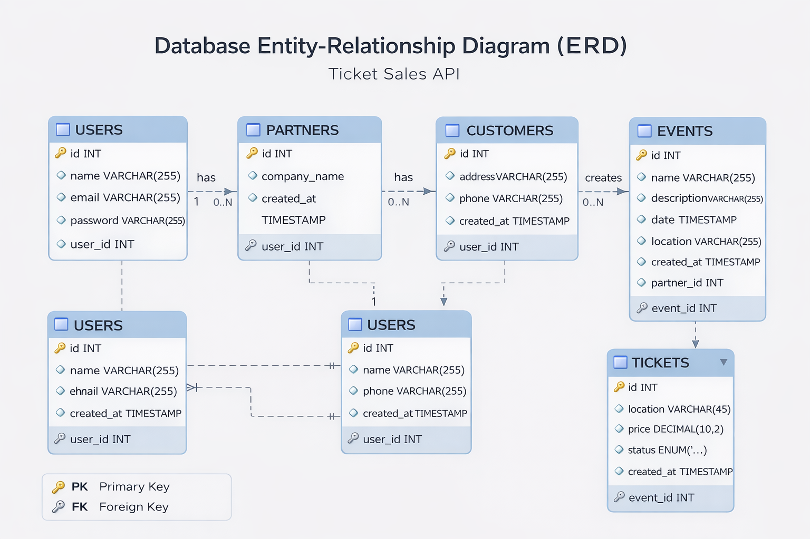

# 🎟️ Ticket Sales API

<p align="center">
  
  
  
  
</p>

---

<p align="center">
  <strong>
    API REST para criação, gerenciamento e venda de ingressos para eventos
  </strong>
</p>

<p align="center">
  Construída com foco em <b>fundamentos sólidos</b>, evolução arquitetural e controle de concorrência 🚀
</p>

---

> ⚠️ O projeto ainda está em evolução e ainda não atingiu o nível final descrito aqui.  
> Este README representa **onde o projeto está caminhando**.

---

## 📌 Visão Geral

O sistema permite:

- 🧑‍💼 Parceiros criarem eventos
- 🎫 Gerenciamento de tickets por lote
- 🛒 Clientes comprarem ingressos
- ❌ Cancelamento de compras
- 📊 Controle de concorrência (evita vendas duplicadas)
- ⚡ Evolução progressiva de arquitetura (monolito → camadas → hexagonal)

---

## 🧠 Regras de Negócio

### 🎟️ Gerenciamento de Tickets

- Apenas o parceiro criador pode gerenciar tickets
- Tickets são criados em lote
- Status inicial: **disponível**

---

### 🛒 Compra de Tickets

- Cliente pode comprar múltiplos tickets
- Um ticket só pode ser comprado uma única vez
- Controle de concorrência evita duplicidade
- Falhas de compra são registradas

---

### ❌ Cancelamento

- Tickets voltam para **disponível**
- Histórico de status é mantido

---

### ⚡ Concorrência

- Preparado para múltiplas requisições simultâneas
- Regras garantem integridade da compra

---

## 🧪 Testes (MUUUITO IMPORTANTE)

> 🚨 Parte essencial do projeto

### 🧪 Tecnologias

- Vitest
- Axios

---

### 📌 Cenários testados

#### ✅ Sucesso

- Criação de evento (201)

#### ❌ Erros

- ownerId inválido
- preço negativo
- latitude/longitude inválidas
- data no passado

#### ⚠️ Regras críticas

- Evitar eventos duplicados
- Garantir integridade de compra

---

### ▶️ Rodar testes

```bash
pnpm test
pnpm test:watch
```

---

## 🏗️ Arquitetura (Evolução)

- ✅ Monolito funcional
- ✅ Camada de Services
- 🔄 Em evolução para Arquitetura Hexagonal

---

## 🛠️ Tecnologias

<p align="center">


</p>

<p align="center">
Node.js • TypeScript • Express • MySQL • PostgreSQL • Vitest • ESLint • Prettier • Git
</p>

---

## 🔁 Fluxo de Compra



---

## 🚀 Diferenciais

- ⚡ Controle de concorrência
- 🧪 Testes automatizados
- 🧠 Evolução arquitetural real
- 📈 Projeto focado em fundamentos sólidos

---

## 🗂️ Database ERD

<p align="center">
  
</p>

## 👩‍💻 Autora

**Viviane Aguiar**  
Backend Developer | Node.js | TypeScript

---

## ⭐ Se este projeto te chamou atenção

Deixe uma ⭐ e acompanhe a evolução 🚀
