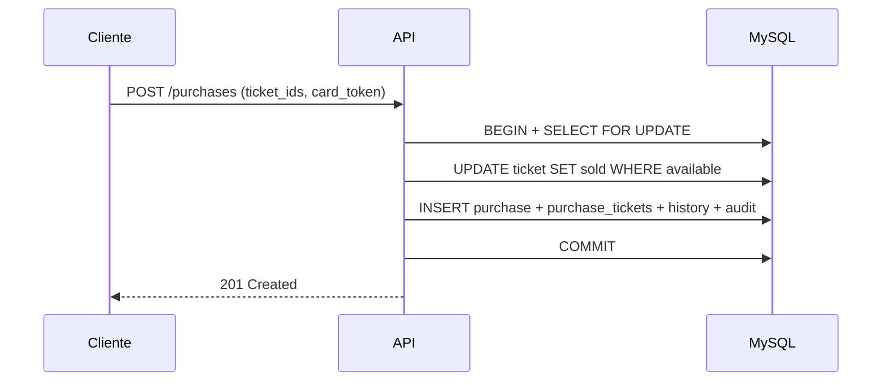

# Ticket Sales API

API REST para venda de ingressos de eventos, com autenticação JWT, reservas temporárias, compras, cancelamentos, histórico de status, audit logs e controle de concorrência em MySQL.

Projeto de portfólio com foco em **fundamentos de backend**: transações, locking pessimista, testes automatizados (unitários, integração e E2E) e evolução incremental para **Clean Architecture**.

---

## Visão geral

O **Ticket Sales** conecta **parceiros** (organizadores) e **clientes** (compradores) em um fluxo completo de ticketing:

1. Partner cria evento e tickets
2. Customer reserva ou compra ingressos
3. Sistema garante integridade em cenários concorrentes
4. Reservas expiram automaticamente; compras podem ser canceladas
5. Toda ação relevante é auditada e rastreável

**Documentação técnica:**

| Documento                                          | Conteúdo                                 |
| -------------------------------------------------- | ---------------------------------------- |
| [docs/architecture.md](docs/architecture.md)       | Camadas, migração, decisões e trade-offs |
| [docs/business-rules.md](docs/business-rules.md)   | Regras de domínio detalhadas             |
| [docs/interview-guide.md](docs/interview-guide.md) | Roteiro para entrevistas técnicas        |

---

## Problema que o sistema resolve

Em vendas de ingressos, múltiplos clientes podem tentar comprar o **mesmo ticket** ao mesmo tempo. Sem controle adequado, o sistema pode:

- Vender o mesmo ingresso duas vezes (double selling)
- Deixar tickets bloqueados indefinidamente após reservas abandonadas
- Perder rastreabilidade de quem fez o quê e quando

O Ticket Sales resolve isso com **transações MySQL**, **locking pessimista** (`SELECT FOR UPDATE`), **updates condicionais de status** e um **job de expiração** de reservas.

---

## Principais funcionalidades

| Funcionalidade   | Descrição                                                      |
| ---------------- | -------------------------------------------------------------- |
| Autenticação JWT | Login, cadastro de partner/customer, rotas protegidas          |
| Eventos          | CRUD por partner; listagem pública                             |
| Tickets          | Criação em lote, listagem, ciclo `available → reserved → sold` |
| Reservas         | Bloqueio temporário (5 min) com expiração automática           |
| Compras          | Compra transacional com `card_token` (contrato API)            |
| Cancelamento     | Restaura tickets e cancela purchase                            |
| Histórico        | `ticket_status_history` + consulta unificada por evento        |
| Audit logs       | Rastreabilidade de ações de negócio                            |
| Health / Ready   | Liveness e readiness com verificação real do MySQL             |
| Swagger          | Documentação interativa em `/docs`                             |
| Docker           | Compose com API + MySQL; Dockerfile para deploy                |
| Testes           | ~331 unit/integration + 15 E2E; cobertura ~86%                 |

---

## Regras de negócio (resumo)

```
available → reserved → sold
     ↑         │         │
     └─────────┴─────────┘
   (expiração / cancelamento)
```

| Regra        | Detalhe                                          |
| ------------ | ------------------------------------------------ |
| Reserva      | Tickets `available`; expira em **5 minutos**     |
| Expiração    | Job a cada **60s** libera reservas vencidas      |
| Compra       | Tickets `available`; cria purchase `paid`        |
| Cancelamento | Tickets `sold → available`; purchase `cancelled` |
| Concorrência | `FOR UPDATE` + `UPDATE WHERE status = ...`       |

Detalhes completos: [docs/business-rules.md](docs/business-rules.md)

---

## Arquitetura

Evolução incremental para Clean Architecture / Hexagonal (Strangler Fig Pattern):

```text
HTTP (Controllers)
        ↓
Factories (composition root)
        ↓
Application (Use Cases)     ← ports (interfaces)
        ↓
Infra (Repositories)        ← adapters MySQL
        ↓
Models legados / MySQL
```

**Módulos migrados:** Reservations, Purchases, Tickets, Events, Identidade (Auth/Users/Partners/Customers).

Detalhes: [docs/architecture.md](docs/architecture.md)

---

## Stack

| Camada    | Tecnologia                          |
| --------- | ----------------------------------- |
| Runtime   | Node.js 20+ (recomendado 24)        |
| Linguagem | TypeScript 5                        |
| API       | Express 5                           |
| Banco     | MySQL 8 (mysql2)                    |
| Auth      | JWT + bcrypt                        |
| Testes    | Vitest + Supertest                  |
| Qualidade | ESLint, Prettier, Husky, Commitlint |
| Container | Docker + Docker Compose             |
| Docs      | Swagger UI (`/docs`)                |

---

## Estrutura de pastas

```text
src/
├── domain/           # Entidades, erros, ports (repositories)
├── application/      # Use cases (regras de negócio)
├── infra/            # Repositories MySQL, JWT, factories
├── shared/mappers/   # Domínio ↔ contratos HTTP
├── controller/       # Rotas Express (entrada HTTP)
├── services/         # Facades finos + EventService.getHistory
├── use-cases/        # 3 use cases legados (ticket-controller + job)
├── models/           # Acesso MySQL (Active Record)
├── jobs/             # Job de expiração de reservas
├── e2e/              # Testes E2E com MySQL real
├── docs/             # Swagger
├── app.ts            # Express + middleware JWT
├── server.ts         # Bootstrap + job
└── database.ts       # Pool MySQL

docs/                 # Documentação técnica
api.http              # Fluxo manual HTTP
db.sql                # Schema MySQL
.env.example          # Variáveis de ambiente
```

---

## Fluxos principais

### 1. Cadastro e login

`POST /partners/register` ou `/customers/register` → `POST /auth/login` → JWT

### 2. Partner: evento + tickets

`POST /partners/events` → `POST /partners/events/:eventId/tickets`

### 3. Customer: reserva

`POST /partners/events/reservations` com `{ "ticket_ids": [...] }`

### 4. Expiração automática

Job `startReleaseExpiredReservationsJob()` — a cada 60s libera reservas vencidas.

### 5. Customer: compra e cancelamento

`POST /partners/events/purchases` com `{ "ticket_ids": [...], "card_token": "..." }`  
`POST /partners/events/purchases/:id/cancel`

---

## Endpoints principais

| Método | Rota                                    | Auth | Descrição                  |
| ------ | --------------------------------------- | ---- | -------------------------- |
| GET    | `/health`                               | Não  | Health check (API + MySQL) |
| GET    | `/ready`                                | Não  | Readiness                  |
| POST   | `/auth/login`                           | Não  | Login                      |
| POST   | `/partners/register`                    | Não  | Cadastro parceiro          |
| POST   | `/customers/register`                   | Não  | Cadastro cliente           |
| GET    | `/events`                               | Não  | Listar eventos             |
| POST   | `/partners/events`                      | Sim  | Criar evento               |
| GET    | `/partners/events`                      | Sim  | Eventos do parceiro        |
| GET    | `/partners/events/:eventId/history`     | Sim  | Histórico do evento        |
| POST   | `/partners/events/:eventId/tickets`     | Sim  | Criar tickets              |
| GET    | `/partners/events/:eventId/tickets`     | Sim  | Listar tickets             |
| POST   | `/partners/events/reservations`         | Sim  | Reservar tickets           |
| POST   | `/partners/events/purchases`            | Sim  | Comprar tickets            |
| POST   | `/partners/events/purchases/:id/cancel` | Sim  | Cancelar compra            |
| GET    | `/docs`                                 | Não  | Swagger UI                 |

---

## Como rodar localmente

### Pré-requisitos

- Node.js 20+ e pnpm 10+ **ou** Docker + Docker Compose

### Passos

```bash
git clone <url-do-repositorio>
cd ticket-sales
pnpm install
cp .env.example .env
docker compose up -d mysql    # MySQL na porta 3307
pnpm dev                      # API em http://localhost:3000
```

---

## Como rodar com Docker

### API + MySQL (recomendado)

```bash
docker compose up --build -d
docker compose ps
curl http://localhost:3000/health
```

| Serviço | Container          | Porta host |
| ------- | ------------------ | ---------- |
| API     | `ticket-sales-api` | 3000       |
| MySQL   | `ticket-sales-db`  | 3307       |

Resetar banco (reaplica `db.sql`):

```bash
docker compose down -v
docker compose up --build -d
```

Acessar MySQL:

```bash
docker exec -it ticket-sales-db mysql -uroot -proot tickets
```

---

## Configuração (.env)

```bash
cp .env.example .env
```

| Variável      | Local (`pnpm dev`) | Docker Compose (API)   |
| ------------- | ------------------ | ---------------------- |
| `PORT`        | `3000`             | `3000`                 |
| `HOST`        | `0.0.0.0`          | `0.0.0.0`              |
| `DB_HOST`     | `localhost`        | `mysql`                |
| `DB_PORT`     | `3307`             | `3306`                 |
| `DB_USER`     | `root`             | `root`                 |
| `DB_PASSWORD` | `root`             | `root`                 |
| `DB_NAME`     | `tickets`          | `tickets`              |
| `JWT_SECRET`  | altere em produção | valor forte no compose |

Em `NODE_ENV=production`, a API **falha no startup** se variáveis obrigatórias estiverem ausentes ou se `JWT_SECRET` for o padrão.

> `CORS_ORIGIN`, `RATE_LIMIT_*` estão documentados em `.env.example` como evolução futura — ainda não implementados.

---

## Como rodar testes

```bash
# Unitários + integração (sem MySQL)
pnpm test

# Cobertura (metas: statements/lines/functions ≥ 80%, branches ≥ 75%)
pnpm test:coverage

# E2E — fluxo principal (requer MySQL)
pnpm test:e2e

# Qualidade
pnpm lint
pnpm build
pnpm check    # format + lint + typecheck + test + build
```

**E2E:** `docker compose up -d mysql` antes de `pnpm test:e2e`. Se MySQL indisponível, testes E2E são ignorados.

---

## Como testar com api.http

1. Suba o ambiente: `docker compose up -d` ou `docker compose up -d mysql` + `pnpm dev`
2. Abra `api.http` no VS Code/Cursor (REST Client)
3. Execute blocos **0 → 12** na ordem
4. IDs de tickets são capturados automaticamente do passo 7
5. Valide no MySQL com queries do passo 12

---

## Como validar no MySQL

```bash
docker exec -it ticket-sales-db mysql -uroot -proot tickets
```

```sql
-- Status dos tickets
SELECT id, event_id, status, price FROM tickets ORDER BY id;

-- Histórico de transições
SELECT ticket_id, from_status, to_status, changed_at
FROM ticket_status_history ORDER BY changed_at DESC LIMIT 20;

-- Reservas ativas
SELECT id, ticket_id, status, expires_at FROM reservation_tickets ORDER BY id DESC;

-- Compras
SELECT id, customer_id, status, total_amount FROM purchases ORDER BY id DESC;

-- Auditoria
SELECT action, entity_type, entity_id, created_at
FROM audit_logs ORDER BY created_at DESC LIMIT 20;
```

---

## Segurança (implementado)

| Item                              | Status           |
| --------------------------------- | ---------------- |
| Senhas com bcrypt                 | ✅               |
| JWT com expiração (1h)            | ✅               |
| Middleware de autenticação        | ✅               |
| Validação de env em produção      | ✅               |
| Transações e integridade de dados | ✅               |
| Helmet / CORS / Rate limiting     | 🔜 Próximo passo |
| Logs estruturados (Pino/Winston)  | 🔜 Próximo passo |

---

## Deploy

A API suporta deploy via **Docker** (Render, Railway, etc.).

```bash
pnpm install --frozen-lockfile
pnpm build
NODE_ENV=production pnpm start
```

Variáveis obrigatórias em produção: `NODE_ENV`, `PORT`, `HOST`, `DB_*`, `JWT_SECRET` (forte).

Checklist pós-deploy:

- [ ] `GET /health` → `200` com `database: connected`
- [ ] `GET /ready` → `{ "ready": true }`
- [ ] Schema `db.sql` aplicado
- [ ] `JWT_SECRET` não é o valor padrão

---

## Status do projeto

| Área                                   | Status  |
| -------------------------------------- | ------- |
| CRUD partners/customers/events/tickets | ✅      |
| Reserva + expiração automática         | ✅      |
| Compra + cancelamento                  | ✅      |
| Concorrência (transações + FOR UPDATE) | ✅      |
| Histórico + audit logs                 | ✅      |
| Testes (unit/integration/E2E)          | ✅      |
| Docker Compose                         | ✅      |
| Clean Architecture (5 módulos)         | ✅      |
| Deploy cloud (Docker)                  | ✅      |
| CI/CD pipeline                         | 🔜      |
| Helmet / CORS / Rate limit             | 🔜      |
| Swagger completo                       | Parcial |

**Maturidade:** portfólio **intermediário-avançado** — fundamentos sólidos de backend com caminho claro para produção.

---

## Próximos passos

- Pipeline CI (lint + test + build)
- Helmet, CORS e rate limiting
- Logs estruturados
- Unificar rotas legadas em `ticket-controller`
- Migrar `EventService.getHistory` para application layer
- Lock distribuído no job de expiração (multi-instância)
- Testcontainers para integração com MySQL
- Swagger com schemas completos

---

## Diagrama — compra transacional



---

## Autora

**Viviane Aguiar**  
Backend Developer | Node.js | TypeScript

---

## Licença

ISC
