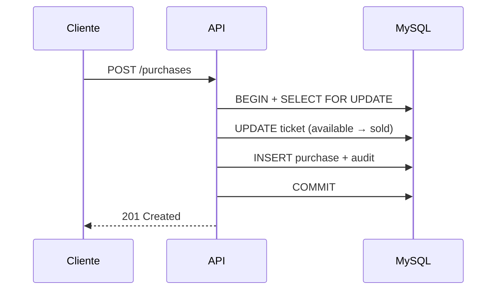

# Ticket Sales API

> API REST de venda de ingressos com **transações MySQL**, **controle de concorrência**, reservas com expiração automática, audit logs e evolução incremental para **Clean Architecture**.

[](https://nodejs.org/)
[](https://www.typescriptlang.org/)
[](https://expressjs.com/)
[](https://www.mysql.com/)
[](https://vitest.dev/)
[](https://www.docker.com/)
[]()

---

## Início rápido

```bash
pnpm install
cp .env.example .env
docker compose up -d mysql   # ou: docker compose up --build -d
pnpm dev                     # http://localhost:3000
pnpm test                    # 331 testes unit/integration
curl http://localhost:3000/health
```

Fluxo manual completo: abra [`api.http`](api.http) e execute os passos **0 → 12**.

---

## Destaques técnicos

| Destaque                           | O que demonstra                                                                  |
| ---------------------------------- | -------------------------------------------------------------------------------- |
| **Transações MySQL**               | Reserva, compra e cancelamento atômicos (`BEGIN` / `COMMIT` / `ROLLBACK`)        |
| **Controle de concorrência**       | `SELECT FOR UPDATE` + `UPDATE WHERE status = 'available'` — evita double selling |
| **Expiração automática**           | Job a cada 60s libera reservas vencidas (5 min) e restaura tickets               |
| **Audit logs**                     | Rastreabilidade de eventos de negócio na mesma transação da operação             |
| **Health / Readiness**             | `GET /health` e `GET /ready` com verificação real do MySQL                       |
| **Docker**                         | Compose API + MySQL; schema `db.sql` aplicado automaticamente                    |
| **Testes automatizados**           | 331 unit/integration + 15 E2E; cobertura ~86%                                    |
| **Clean Architecture incremental** | 5 módulos migrados (Strangler Fig — sem big bang)                                |
| **Segurança básica**               | JWT, bcrypt, middleware de auth, validação de env em produção                    |
| **Hardening HTTP**                 | CORS / rate limit documentados em `.env.example` — roadmap                       |

---

## Stack

`Node.js` · `TypeScript` · `Express 5` · `MySQL` · `JWT` · `bcrypt` · `Vitest` · `Supertest` · `Docker` · `Swagger`

---

## Funcionalidades

- Autenticação JWT (partners e customers)
- Eventos e tickets em lote
- Reservas temporárias (`available → reserved`)
- Compras transacionais (`available → sold`)
- Cancelamento com restauração de tickets
- Histórico de status + consulta unificada por evento
- Listagem pública de eventos

Regras detalhadas: [docs/business-rules.md](docs/business-rules.md)

---

## Arquitetura

```text
Controller → Factory → Use Case → Repository (port) → Adapter MySQL → Model
```

Módulos migrados: **Reservations · Purchases · Tickets · Events · Identidade**

Documentação: [docs/architecture.md](docs/architecture.md)

---

## Exemplos de endpoints

```http
GET  /health
POST /auth/login
POST /partners/register
POST /partners/events
POST /partners/events/:eventId/tickets
POST /partners/events/reservations      # { "ticket_ids": [1, 2] }
POST /partners/events/purchases         # { "ticket_ids": [3], "card_token": "..." }
POST /partners/events/purchases/:id/cancel
GET  /docs
```

| Método | Rota                                | Auth | Descrição           |
| ------ | ----------------------------------- | ---- | ------------------- |
| GET    | `/health`                           | Não  | API + MySQL         |
| GET    | `/ready`                            | Não  | Readiness           |
| POST   | `/auth/login`                       | Não  | Login → JWT         |
| POST   | `/partners/events/reservations`     | Sim  | Reservar tickets    |
| POST   | `/partners/events/purchases`        | Sim  | Comprar tickets     |
| GET    | `/partners/events/:eventId/history` | Sim  | Histórico do evento |

Lista completa na seção [Endpoints](#endpoints-completos) abaixo.

---

## Checklist — validar o projeto

```bash
pnpm install          # 1. dependências
docker compose up -d  # 2. MySQL (+ API opcional)
pnpm dev              # 3. API local (se não usar container api)
pnpm test             # 4. testes
pnpm lint             # 5. ESLint
pnpm build            # 6. compilar TypeScript
```

Opcional: `pnpm test:e2e` (requer MySQL) · `pnpm test:coverage` · `pnpm check` (pipeline completa)

Validação manual: [`api.http`](api.http) passos 0–12 → `curl /health` → queries MySQL no passo 12.

---

## Docker

```bash
# API + MySQL
docker compose up --build -d

# Apenas MySQL (dev local com pnpm dev)
docker compose up -d mysql

# Reset do banco
docker compose down -v && docker compose up --build -d

# MySQL shell
docker exec -it ticket-sales-db mysql -uroot -proot tickets
```

| Serviço | Container          | Porta |
| ------- | ------------------ | ----- |
| API     | `ticket-sales-api` | 3000  |
| MySQL   | `ticket-sales-db`  | 3307  |

---

## Testes

| Comando              | Descrição                                  |
| -------------------- | ------------------------------------------ |
| `pnpm test`          | Unitários + integração (331 testes)        |
| `pnpm test:e2e`      | Fluxo principal com MySQL real (15 testes) |
| `pnpm test:coverage` | Cobertura (~86%; metas ≥ 80%)              |
| `pnpm lint`          | ESLint                                     |
| `pnpm format`        | Prettier                                   |
| `pnpm typecheck`     | TypeScript sem emit                        |
| `pnpm build`         | Compilar para `dist/`                      |
| `pnpm start`         | Rodar build de produção                    |

---

## Deploy no Render

### Pré-requisitos

1. Repositório no GitHub conectado ao Render
2. Banco MySQL no Render (ou externo)
3. Schema `db.sql` aplicado no MySQL de produção

### Blueprint (recomendado)

O arquivo [`render.yaml`](render.yaml) na raiz configura Web Service + MySQL automaticamente:

```bash
# No dashboard Render: New → Blueprint → conectar repositório
```

### Web Service manual

| Campo                 | Valor                        |
| --------------------- | ---------------------------- |
| **Runtime**           | Node                         |
| **Build Command**     | `pnpm install && pnpm build` |
| **Start Command**     | `pnpm start`                 |
| **Health Check Path** | `/health`                    |

### Variáveis de ambiente (produção)

| Variável              | Obrigatória | Descrição                               |
| --------------------- | ----------- | --------------------------------------- |
| `NODE_ENV`            | Sim         | `production`                            |
| `HOST`                | Sim         | `0.0.0.0`                               |
| `PORT`                | Não         | Render injeta automaticamente           |
| `DB_HOST`             | Sim         | Host do MySQL Render                    |
| `DB_PORT`             | Sim         | `3306`                                  |
| `DB_USER`             | Sim         | Usuário do banco                        |
| `DB_PASSWORD`         | Sim         | Senha do banco                          |
| `DB_NAME`             | Sim         | `tickets`                               |
| `JWT_SECRET`          | Sim         | Segredo forte (não use o padrão)        |
| `HUSKY`               | Recomendado | `0` (evita hook no CI/Render)           |
| `RENDER_EXTERNAL_URL` | Auto        | Injetado pelo Render — usado no Swagger |
| `CORS_ORIGIN`         | Não         | Planejado (ainda não implementado)      |

### Aplicar schema no MySQL Render

Execute o conteúdo de `db.sql` no banco via Shell do Render ou cliente MySQL externo.

### Validar após deploy

```bash
curl https://seu-servico.onrender.com/health
curl https://seu-servico.onrender.com/ready
```

Resposta esperada do health:

```json
{ "status": "ok", "database": "connected", "timestamp": "..." }
```

### Swagger público

Documentação interativa disponível **sem autenticação**:

```
https://seu-servico.onrender.com/docs
```

No Swagger UI, use **Authorize** com `Bearer <token>` após login para testar rotas protegidas.

---

## Configuração (.env)

```bash
cp .env.example .env
```

| Variável     | Local              | Docker (API) |
| ------------ | ------------------ | ------------ |
| `DB_HOST`    | `localhost`        | `mysql`      |
| `DB_PORT`    | `3307`             | `3306`       |
| `JWT_SECRET` | altere em produção | valor forte  |

---

## Documentação

| Documento                                          | Conteúdo                      |
| -------------------------------------------------- | ----------------------------- |
| [docs/architecture.md](docs/architecture.md)       | Camadas, migração, trade-offs |
| [docs/business-rules.md](docs/business-rules.md)   | Regras de domínio             |
| [docs/interview-guide.md](docs/interview-guide.md) | Entrevistas técnicas          |
| [api.http](api.http)                               | Fluxo HTTP manual             |

---

## Estrutura do projeto

```text
src/
├── domain/         # Entidades, erros, ports
├── application/    # Use cases
├── infra/          # Repositories, JWT, factories
├── controller/     # Rotas HTTP
├── e2e/            # Testes E2E
├── models/         # Persistência (Active Record)
└── jobs/           # Expiração de reservas
```

---

## Validação no MySQL

```sql
SELECT id, status, price FROM tickets ORDER BY id;
SELECT action, entity_type, created_at FROM audit_logs ORDER BY created_at DESC LIMIT 10;
SELECT ticket_id, from_status, to_status FROM ticket_status_history ORDER BY changed_at DESC LIMIT 10;
```

---

## Endpoints completos

| Método | Rota                                    | Auth | Descrição           |
| ------ | --------------------------------------- | ---- | ------------------- |
| GET    | `/health`                               | Não  | Health check        |
| GET    | `/ready`                                | Não  | Readiness           |
| POST   | `/auth/login`                           | Não  | Login               |
| POST   | `/partners/register`                    | Não  | Cadastro parceiro   |
| POST   | `/customers/register`                   | Não  | Cadastro cliente    |
| GET    | `/events`                               | Não  | Listar eventos      |
| POST   | `/partners/events`                      | Sim  | Criar evento        |
| GET    | `/partners/events`                      | Sim  | Eventos do parceiro |
| GET    | `/partners/events/:eventId/history`     | Sim  | Histórico           |
| POST   | `/partners/events/:eventId/tickets`     | Sim  | Criar tickets       |
| GET    | `/partners/events/:eventId/tickets`     | Sim  | Listar tickets      |
| POST   | `/partners/events/reservations`         | Sim  | Reservar            |
| POST   | `/partners/events/purchases`            | Sim  | Comprar             |
| POST   | `/partners/events/purchases/:id/cancel` | Sim  | Cancelar            |
| GET    | `/docs`                                 | Não  | Swagger UI          |

---

## Status do projeto

| Área                                           | Status |
| ---------------------------------------------- | ------ |
| Domínio completo (reserva/compra/cancelamento) | ✅     |
| Concorrência + transações                      | ✅     |
| Testes + E2E + cobertura                       | ✅     |
| Docker + deploy                                | ✅     |
| Deploy Render (Node + Swagger público)         | ✅     |
| Clean Architecture (5 módulos)                 | ✅     |
| CI/CD · Rate limit · CORS · Helmet             | 🔜     |

**Maturidade:** portfólio intermediário-avançado — pronto para GitHub, currículo e entrevistas.

---

## Diagrama — compra



---

## Autora

**Viviane Aguiar** — Backend Developer · Node.js · TypeScript

- LinkedIn: [linkedin.com/in/vivianeaguiarc](https://www.linkedin.com/in/vivianeaguiarc/)
- Email: [vivianeaguiarc@outlook.com](mailto:vivianeaguiarc@outlook.com)

## Licença

ISC
