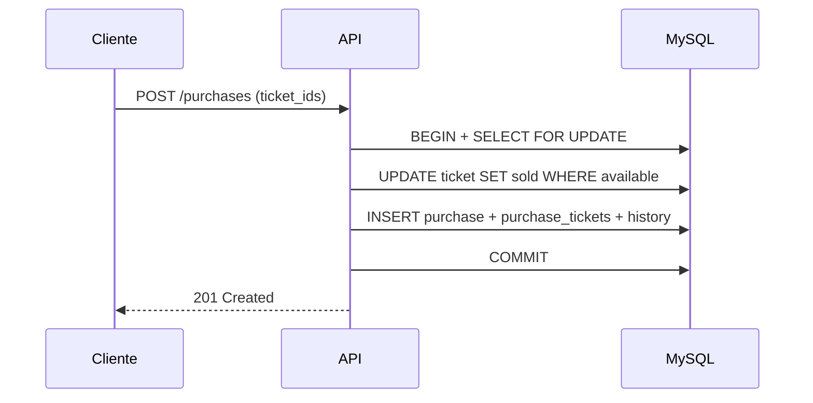

# Ticket Sales API

API REST para venda de ingressos de eventos, com autenticação JWT, reservas temporárias, compras, cancelamentos, histórico de status e controle de concorrência em MySQL.

Projeto desenvolvido com foco em fundamentos de backend: transações, locking pessimista, testes automatizados e evolução arquitetural em camadas.

---

## Objetivo do sistema

Permitir que **parceiros** criem eventos e tickets, e que **clientes** reservem ou comprem ingressos de forma segura, evitando venda duplicada do mesmo ticket em cenários concorrentes.

---

## Regras de negócio principais

### Ciclo de vida do ticket

```
available → reserved → sold
```

- Cancelamentos e expirações de reserva restauram o ticket para `available`.
- Toda mudança relevante de status é registrada em `ticket_status_history`.
- Ações importantes do sistema são registradas em `audit_logs` (criação de eventos/tickets, reservas, compras, cancelamentos e expirações).

### Audit logs

A tabela `audit_logs` registra eventos de negócio e técnicos para rastreabilidade e auditoria:

| Action                | Entity        | Quando                                       |
| --------------------- | ------------- | -------------------------------------------- |
| `EVENT_CREATED`       | `event`       | Parceiro cria um evento                      |
| `TICKETS_CREATED`     | `ticket`      | Parceiro cria tickets em lote                |
| `TICKETS_RESERVED`    | `reservation` | Cliente reserva tickets                      |
| `RESERVATION_EXPIRED` | `reservation` | Job libera reserva expirada (`user_id` nulo) |
| `PURCHASE_CREATED`    | `purchase`    | Cliente compra tickets                       |
| `PURCHASE_CANCELLED`  | `purchase`    | Compra é cancelada                           |

Cada registro pode incluir `user_id`, `entity_id`, `old_data` e `new_data` (JSON) com o contexto da operação. Os audit logs são gravados na mesma transação da operação principal.

Consulta no MySQL:

```sql
SELECT * FROM audit_logs ORDER BY created_at DESC;
```

Filtrar por ação:

```sql
SELECT * FROM audit_logs WHERE action = 'PURCHASE_CREATED' ORDER BY created_at DESC;
```

### Histórico do evento (API)

Partners autenticados podem consultar alterações e auditorias dos tickets de um evento:

```http
GET /partners/events/:eventId/history
Authorization: Bearer <token_partner>
```

Retorna um array unificado com `ticket_status_history` e `audit_log`, ordenado por data decrescente. Apenas o partner dono do evento pode acessar (403 caso contrário).

### Health e Readiness

Endpoints públicos para monitoramento e orquestração (Kubernetes, Docker, load balancers):

| Endpoint      | Uso           | Sucesso (200)                                        | Falha (503)                |
| ------------- | ------------- | ---------------------------------------------------- | -------------------------- |
| `GET /health` | Liveness + DB | `{ status: "ok", database: "connected", timestamp }` | `database: "disconnected"` |
| `GET /ready`  | Readiness     | `{ ready: true }`                                    | `{ ready: false }`         |

Ambos executam `SELECT 1` no MySQL para validar conexão real.

### Tickets

- Criados em lote pelo parceiro dono do evento.
- Status inicial: `available`.

### Reservas

- Cliente autenticado pode reservar um ou mais tickets `available`.
- Reserva expira automaticamente após 5 minutos (job em background).
- Na expiração: reserva → `cancelled`, ticket → `available`, histórico registrado.

### Compras

- Cliente autenticado compra tickets `available`.
- Compra cria `purchase`, `purchase_tickets`, altera ticket para `sold` e registra histórico.
- Operações críticas usam `UPDATE ... WHERE status = 'available'` para evitar double selling.

### Cancelamento de compra

- Restaura tickets para `available`.
- Atualiza purchase para `cancelled`.
- Cancela reservas relacionadas, se existirem.
- Registra histórico `sold → available`.

### Concorrência

- `SELECT ... FOR UPDATE` em operações críticas.
- Atualizações condicionais de status (`reserveIfAvailable`, `sellIfAvailable`).
- Transações com `commit` / `rollback` e `release()` da conexão.

---

## Stack utilizada

| Camada    | Tecnologia                                       |
| --------- | ------------------------------------------------ |
| Runtime   | Node.js 24                                       |
| Linguagem | TypeScript 5                                     |
| API       | Express 5                                        |
| Banco     | MySQL (mysql2)                                   |
| Auth      | JWT + bcrypt                                     |
| Testes    | Vitest + Supertest                               |
| Qualidade | ESLint, Prettier, Husky, lint-staged, Commitlint |
| Docs      | Swagger UI (`/docs`)                             |

---

## Arquitetura

O projeto segue uma arquitetura em camadas, em evolução para separação mais clara de responsabilidades:

```text
HTTP (Controllers/Routes)
        ↓
Application (Use Cases)
        ↓
Services (regras e orquestração)
        ↓
Models (acesso a dados / MySQL)
        ↓
Jobs (tarefas agendadas)
```

**Padrões adotados hoje:**

- Controllers: entrada HTTP, validação básica, status codes.
- Use Cases: fluxos transacionais críticos (compra, reserva, cancelamento, expiração).
- Services: lógica de domínio e integrações (auth, pagamento simulado, tickets).
- Models: queries SQL e entidades de persistência.
- Jobs: expiração automática de reservas a cada 60 segundos.

---

## Estrutura de pastas

```text
src/
├── controller/       # Rotas HTTP (Express)
├── use-cases/      # Casos de uso transacionais
├── services/       # Serviços de domínio
├── models/         # Acesso ao MySQL
├── jobs/           # Tarefas agendadas
├── docs/           # Swagger
├── types/          # Tipagens globais (Express)
├── app.ts          # Configuração Express + middlewares
├── server.ts       # Bootstrap da API + job de expiração
└── database.ts     # Pool MySQL (singleton)
```

Arquivos de apoio na raiz:

- `api.http` — fluxo manual de testes
- `db.sql` — schema do banco
- `.env.example` — variáveis recomendadas (evolução futura)

---

## Fluxos principais

### 1. Cadastro e login

1. `POST /partners/register` ou `POST /customers/register`
2. `POST /auth/login` → retorna JWT
3. Rotas protegidas exigem header `Authorization: Bearer <token>`

### 2. Criação de evento

1. Parceiro autenticado chama `POST /partners/events`
2. Evento vinculado ao parceiro logado

### 3. Criação de tickets

1. `POST /partners/events/:eventId/tickets`
2. Body: `{ "num_tickets": 5, "price": 100 }`
3. Tickets criados com status `available`

### 4. Reserva

1. Cliente autenticado chama `POST /partners/events/reservations`
2. Body: `{ "ticket_ids": [1, 2] }`
3. Tickets passam para `reserved` com expiração em 5 minutos

### 5. Expiração automática

1. Job `startReleaseExpiredReservationsJob()` inicia com o servidor
2. A cada 60 segundos executa `ReleaseExpiredReservationsUseCase`
3. Reservas expiradas são canceladas e tickets liberados

### 6. Compra

1. Cliente autenticado chama `POST /partners/events/purchases`
2. Body: `{ "ticket_ids": [3, 4], "card_token": "..." }`
3. Tickets passam para `sold`, purchase criada como `paid`

### 7. Cancelamento

1. `POST /partners/events/purchases/:id/cancel`
2. Tickets voltam para `available`, purchase → `cancelled`

---

## Endpoints principais

| Método | Rota                                    | Auth | Descrição                  |
| ------ | --------------------------------------- | ---- | -------------------------- |
| GET    | `/health`                               | Não  | Health check (API + MySQL) |
| GET    | `/ready`                                | Não  | Readiness check            |
| POST   | `/auth/login`                           | Não  | Login                      |
| POST   | `/partners/register`                    | Não  | Cadastro parceiro          |
| POST   | `/customers/register`                   | Não  | Cadastro cliente           |
| GET    | `/events`                               | Não  | Listar eventos             |
| POST   | `/partners/events`                      | Sim  | Criar evento               |
| GET    | `/partners/events`                      | Sim  | Listar eventos do parceiro |
| GET    | `/partners/events/:eventId/history`     | Sim  | Histórico do evento        |
| POST   | `/partners/events/:eventId/tickets`     | Sim  | Criar tickets              |
| GET    | `/partners/events/:eventId/tickets`     | Sim  | Listar tickets             |
| POST   | `/partners/events/reservations`         | Sim  | Reservar tickets           |
| POST   | `/partners/events/purchases`            | Sim  | Comprar tickets            |
| POST   | `/partners/events/purchases/:id/cancel` | Sim  | Cancelar compra            |
| GET    | `/docs`                                 | Não  | Swagger UI                 |

---

## Como instalar

### Pré-requisitos

- Node.js 20+ (recomendado 24) e pnpm 10+ **ou** Docker + Docker Compose

### Passos

```bash
git clone <url-do-repositorio>
cd ticket-sales
pnpm install
cp .env.example .env
```

---

## Configuração do banco (MySQL)

### Opção A — Docker Compose completo (API + MySQL) **recomendado**

Sobe a API na porta **3000** e o MySQL na porta **3307** (host), com schema aplicado automaticamente.

```bash
# build e subir em background
docker compose up --build -d

# ver status (api aguarda mysql healthy)
docker compose ps

# logs da API
docker compose logs -f api

# logs do MySQL
docker compose logs -f mysql
```

Parar ambiente:

```bash
docker compose down
```

Resetar volumes (apaga dados e reaplica `db.sql`):

```bash
docker compose down -v
docker compose up --build -d
```

Acessar MySQL no container:

```bash
docker exec -it ticket-sales-db mysql -uroot -proot tickets
```

Health check:

```bash
curl http://localhost:3000/health
curl http://localhost:3000/ready
```

Resposta esperada com tudo saudável:

```json
{ "status": "ok", "database": "connected", "timestamp": "..." }
{ "ready": true }
```

Testar fluxo completo: abra `api.http` e execute os passos (0 → 12) com a API em `http://localhost:3000`.

| Serviço | Container          | Porta host | Porta interna |
| ------- | ------------------ | ---------- | ------------- |
| API     | `ticket-sales-api` | 3000       | 3000          |
| MySQL   | `ticket-sales-db`  | 3307       | 3306          |

A API no Docker usa `DB_HOST=mysql` e `DB_PORT=3306` (definido no `docker-compose.yml`).

### Opção B — Apenas MySQL no Docker + API local (`pnpm dev`)

Útil para desenvolvimento com hot reload.

```bash
# subir só o banco
docker compose up -d mysql

# na raiz do projeto
cp .env.example .env   # DB_HOST=localhost, DB_PORT=3307
pnpm install
pnpm dev
```

### Opção C — MySQL instalado localmente

```bash
mysql -u root -p -P 3307 < db.sql
cp .env.example .env
pnpm dev
```

### Variáveis de ambiente

Copie `.env.example` para `.env`:

| Variável       | Local (`pnpm dev`) | Docker Compose (API) |
| -------------- | ------------------ | -------------------- |
| `PORT`         | `3000`             | `3000`               |
| `DB_HOST`      | `localhost`        | `mysql`              |
| `DB_PORT`      | `3307`             | `3306`               |
| `DB_USER`      | `root`             | `root`               |
| `DB_PASSWORD`  | `root`             | `root`               |
| `DB_NAME`      | `tickets`          | `tickets`            |
| `JWT_SECRET`   | altere em produção | altere em produção   |
| `DB_HOST_PORT` | `3307`             | porta MySQL no host  |

A conexão é configurada via `src/config/env.ts` (carrega `.env` com `dotenv`).

> O script `db.sql` em `docker-entrypoint-initdb.d` só roda na **primeira** criação do volume `mysql_data`.

---

## Configuração de ambiente (.env)

```bash
cp .env.example .env
```

Variáveis principais: `PORT`, `DB_HOST`, `DB_PORT`, `DB_USER`, `DB_PASSWORD`, `DB_NAME`, `JWT_SECRET`. Ver tabela na seção de banco acima.

O JWT usa `JWT_SECRET` do `.env` (padrão: `your_secret_key`). Em produção, use um valor forte.

---

## Como rodar a API

```bash
# desenvolvimento (hot reload)
pnpm dev

# build de produção
pnpm build

# executar build
pnpm start
```

Servidor padrão: `http://localhost:3000`

---

## Como rodar testes

```bash
# suíte completa
pnpm test

# modo watch
pnpm test:watch

# cobertura
pnpm test:coverage
```

Atualmente: **334 testes** cobrindo controllers, use cases, services, models, jobs e fluxo HTTP integrado.

---

## Como testar com api.http

1. Suba o ambiente: `docker compose up --build -d` **ou** `docker compose up -d mysql` + `pnpm dev`.
2. Execute `pnpm dev`.
3. Abra `api.http` no VS Code/Cursor com REST Client.
4. Execute os blocos **na ordem numérica** (1 → 12).
5. Após criar tickets, use `GET /partners/events/:eventId/tickets` para confirmar os IDs.
6. Ajuste `ticket_ids` nas etapas de reserva/compra se necessário.
7. Valide no MySQL usando as queries comentadas no final do arquivo.

---

## Comandos úteis

```bash
docker compose up --build -d  # API + MySQL
docker compose down           # parar
docker compose down -v        # reset volumes + schema
docker compose logs -f api    # logs da API
pnpm dev                      # API local (MySQL no Docker ou local)
pnpm test            # testes
pnpm test:coverage   # cobertura
pnpm lint            # ESLint
pnpm lint:fix        # ESLint com auto-fix
pnpm format          # Prettier
pnpm format:check    # validar formatação
pnpm typecheck       # TypeScript
pnpm fix             # lint:fix + format
pnpm check           # pipeline local completa
pnpm build           # compilar TypeScript
```

---

## Deploy em cloud

A API está pronta para deploy com **Docker** em Render, Railway ou serviços compatíveis.

### Variáveis de ambiente (produção)

| Variável      | Obrigatória | Exemplo / descrição              |
| ------------- | ----------- | -------------------------------- |
| `NODE_ENV`    | Sim         | `production`                     |
| `PORT`        | Sim         | `3000` (Render/Railway injetam)  |
| `HOST`        | Sim         | `0.0.0.0`                        |
| `DB_HOST`     | Sim         | host do MySQL gerenciado         |
| `DB_PORT`     | Sim         | `3306`                           |
| `DB_USER`     | Sim         | usuário do banco                 |
| `DB_PASSWORD` | Sim         | senha forte                      |
| `DB_NAME`     | Sim         | `tickets`                        |
| `JWT_SECRET`  | Sim         | segredo forte (não use o padrão) |

Em `NODE_ENV=production`, a API **falha no startup** se alguma variável obrigatória estiver ausente ou se `JWT_SECRET` for o valor padrão.

### Build e start (sem Docker)

```bash
pnpm install --frozen-lockfile
pnpm build
NODE_ENV=production pnpm start
```

### Endpoints de operação

| Endpoint      | Uso                             |
| ------------- | ------------------------------- |
| `GET /health` | Liveness + verificação do MySQL |
| `GET /ready`  | Readiness (orquestradores)      |
| `GET /docs`   | Swagger UI                      |

### Deploy no Render

1. Crie um **PostgreSQL não** — use **MySQL** (Render MySQL ou banco externo).
2. Aplique o schema: execute `db.sql` no banco (via cliente SQL ou shell).
3. Conecte o repositório GitHub ao Render.
4. Opção A — **Blueprint** (`render.yaml` na raiz):
   ```bash
   # No dashboard Render: New > Blueprint > conectar repo
   ```
5. Opção B — **Web Service manual**:
   - **Runtime:** Docker
   - **Dockerfile path:** `./Dockerfile`
   - **Health Check Path:** `/health`
   - Configure as variáveis da tabela acima (ou vincule o banco Render).
6. Após deploy, valide:
   ```bash
   curl https://<sua-api>.onrender.com/health
   curl https://<sua-api>.onrender.com/ready
   ```

### Deploy no Railway

1. Crie um projeto e adicione **MySQL** (plugin/template).
2. Adicione um serviço a partir do repositório (Dockerfile detectado automaticamente).
3. Em **Variables**, configure:
   - `NODE_ENV=production`
   - `HOST=0.0.0.0`
   - `JWT_SECRET=<gerar valor forte>`
   - `DB_HOST`, `DB_PORT`, `DB_USER`, `DB_PASSWORD`, `DB_NAME` (referências do MySQL Railway)
4. Aplique `db.sql` no MySQL (Railway Query ou cliente externo).
5. Configure health check em **Settings** → path `/health`.
6. Deploy e teste `https://<sua-api>.up.railway.app/health`.

### Deploy com Docker (qualquer cloud)

```bash
docker build -t ticket-sales-api .
docker run -p 3000:3000 \
  -e NODE_ENV=production \
  -e HOST=0.0.0.0 \
  -e PORT=3000 \
  -e JWT_SECRET=<segredo> \
  -e DB_HOST=<host> \
  -e DB_PORT=3306 \
  -e DB_USER=<user> \
  -e DB_PASSWORD=<password> \
  -e DB_NAME=tickets \
  ticket-sales-api
```

### Checklist pós-deploy

- [ ] `GET /health` retorna `200` com `database: connected`
- [ ] `GET /ready` retorna `{ "ready": true }`
- [ ] `GET /docs` abre o Swagger
- [ ] Login e fluxo principal funcionam (`api.http`)
- [ ] `JWT_SECRET` não é o valor padrão
- [ ] Schema `db.sql` aplicado no banco de produção

---

## Status atual do projeto

| Área                                  | Status                        |
| ------------------------------------- | ----------------------------- |
| CRUD de parceiros, clientes e eventos | Implementado                  |
| Criação e listagem de tickets         | Implementado                  |
| Reserva com expiração automática      | Implementado                  |
| Compra e cancelamento                 | Implementado                  |
| Controle de concorrência              | Implementado                  |
| Histórico de status                   | Implementado                  |
| Audit logs                            | Implementado                  |
| Testes automatizados                  | Implementado                  |
| Swagger                               | Básico (endpoints principais) |
| Variáveis de ambiente                 | Implementado (`.env`)         |
| Docker Compose (API + MySQL)          | Implementado                  |
| Health / Readiness endpoints          | Implementado                  |
| Deploy cloud (Docker + env)           | Implementado                  |
| Deploy / CI                           | Parcial (sem pipeline CI)     |

**Maturidade:** projeto de portfólio **intermediário**, com fundamentos sólidos de backend e espaço claro para evolução em produção.

---

## Próximos passos técnicos

- Adicionar pipeline CI (lint + test + build)
- Completar documentação Swagger com schemas de request/response
- Testes de integração com MySQL real (Testcontainers)
- Lock distribuído para job de expiração em multi-instância
- Pagamento real (hoje `PaymentService` é simulado no `PurchaseService`)

---

## Diagrama de fluxo — compra



---

## Autora

**Viviane Aguiar**  
Backend Developer | Node.js | TypeScript

---

## Licença

ISC
