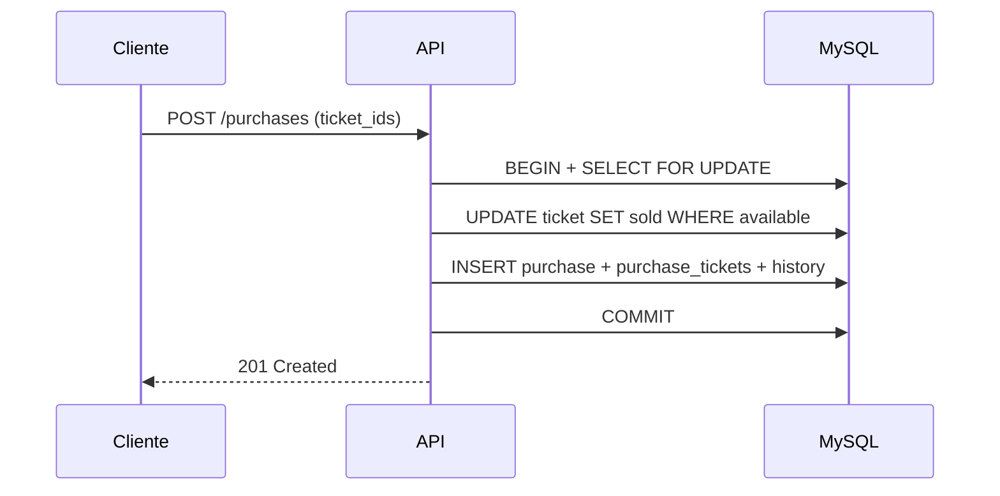

# Ticket Sales API

API REST para venda de ingressos de eventos, com autenticação JWT, reservas temporárias, compras, cancelamentos, histórico de status e controle de concorrência em MySQL.

Projeto desenvolvido com foco em fundamentos de backend: transações, locking pessimista, testes automatizados e evolução arquitetural em camadas.

---

## Objetivo do sistema

Permitir que **parceiros** criem eventos e tickets, e que **clientes** reservem ou comprem ingressos de forma segura, evitando venda duplicada do mesmo ticket em cenários concorrentes.

---

## Regras de negócio principais

### Ciclo de vida do ticket

```
available → reserved → sold
```

- Cancelamentos e expirações de reserva restauram o ticket para `available`.
- Toda mudança relevante de status é registrada em `ticket_status_history`.

### Tickets

- Criados em lote pelo parceiro dono do evento.
- Status inicial: `available`.

### Reservas

- Cliente autenticado pode reservar um ou mais tickets `available`.
- Reserva expira automaticamente após 5 minutos (job em background).
- Na expiração: reserva → `cancelled`, ticket → `available`, histórico registrado.

### Compras

- Cliente autenticado compra tickets `available`.
- Compra cria `purchase`, `purchase_tickets`, altera ticket para `sold` e registra histórico.
- Operações críticas usam `UPDATE ... WHERE status = 'available'` para evitar double selling.

### Cancelamento de compra

- Restaura tickets para `available`.
- Atualiza purchase para `cancelled`.
- Cancela reservas relacionadas, se existirem.
- Registra histórico `sold → available`.

### Concorrência

- `SELECT ... FOR UPDATE` em operações críticas.
- Atualizações condicionais de status (`reserveIfAvailable`, `sellIfAvailable`).
- Transações com `commit` / `rollback` e `release()` da conexão.

---

## Stack utilizada

| Camada    | Tecnologia                                       |
| --------- | ------------------------------------------------ |
| Runtime   | Node.js 24                                       |
| Linguagem | TypeScript 5                                     |
| API       | Express 5                                        |
| Banco     | MySQL (mysql2)                                   |
| Auth      | JWT + bcrypt                                     |
| Testes    | Vitest + Supertest                               |
| Qualidade | ESLint, Prettier, Husky, lint-staged, Commitlint |
| Docs      | Swagger UI (`/docs`)                             |

---

## Arquitetura

O projeto segue uma arquitetura em camadas, em evolução para separação mais clara de responsabilidades:

```text
HTTP (Controllers/Routes)
        ↓
Application (Use Cases)
        ↓
Services (regras e orquestração)
        ↓
Models (acesso a dados / MySQL)
        ↓
Jobs (tarefas agendadas)
```

**Padrões adotados hoje:**

- Controllers: entrada HTTP, validação básica, status codes.
- Use Cases: fluxos transacionais críticos (compra, reserva, cancelamento, expiração).
- Services: lógica de domínio e integrações (auth, pagamento simulado, tickets).
- Models: queries SQL e entidades de persistência.
- Jobs: expiração automática de reservas a cada 60 segundos.

---

## Estrutura de pastas

```text
src/
├── controller/       # Rotas HTTP (Express)
├── use-cases/      # Casos de uso transacionais
├── services/       # Serviços de domínio
├── models/         # Acesso ao MySQL
├── jobs/           # Tarefas agendadas
├── docs/           # Swagger
├── types/          # Tipagens globais (Express)
├── app.ts          # Configuração Express + middlewares
├── server.ts       # Bootstrap da API + job de expiração
└── database.ts     # Pool MySQL (singleton)
```

Arquivos de apoio na raiz:

- `api.http` — fluxo manual de testes
- `db.sql` — schema do banco
- `.env.example` — variáveis recomendadas (evolução futura)

---

## Fluxos principais

### 1. Cadastro e login

1. `POST /partners/register` ou `POST /customers/register`
2. `POST /auth/login` → retorna JWT
3. Rotas protegidas exigem header `Authorization: Bearer <token>`

### 2. Criação de evento

1. Parceiro autenticado chama `POST /partners/events`
2. Evento vinculado ao parceiro logado

### 3. Criação de tickets

1. `POST /partners/events/:eventId/tickets`
2. Body: `{ "num_tickets": 5, "price": 100 }`
3. Tickets criados com status `available`

### 4. Reserva

1. Cliente autenticado chama `POST /partners/events/reservations`
2. Body: `{ "ticket_ids": [1, 2] }`
3. Tickets passam para `reserved` com expiração em 5 minutos

### 5. Expiração automática

1. Job `startReleaseExpiredReservationsJob()` inicia com o servidor
2. A cada 60 segundos executa `ReleaseExpiredReservationsUseCase`
3. Reservas expiradas são canceladas e tickets liberados

### 6. Compra

1. Cliente autenticado chama `POST /partners/events/purchases`
2. Body: `{ "ticket_ids": [3, 4], "card_token": "..." }`
3. Tickets passam para `sold`, purchase criada como `paid`

### 7. Cancelamento

1. `POST /partners/events/purchases/:id/cancel`
2. Tickets voltam para `available`, purchase → `cancelled`

---

## Endpoints principais

| Método | Rota                                    | Auth | Descrição                  |
| ------ | --------------------------------------- | ---- | -------------------------- |
| POST   | `/auth/login`                           | Não  | Login                      |
| POST   | `/partners/register`                    | Não  | Cadastro parceiro          |
| POST   | `/customers/register`                   | Não  | Cadastro cliente           |
| GET    | `/events`                               | Não  | Listar eventos             |
| POST   | `/partners/events`                      | Sim  | Criar evento               |
| GET    | `/partners/events`                      | Sim  | Listar eventos do parceiro |
| POST   | `/partners/events/:eventId/tickets`     | Sim  | Criar tickets              |
| GET    | `/partners/events/:eventId/tickets`     | Sim  | Listar tickets             |
| POST   | `/partners/events/reservations`         | Sim  | Reservar tickets           |
| POST   | `/partners/events/purchases`            | Sim  | Comprar tickets            |
| POST   | `/partners/events/purchases/:id/cancel` | Sim  | Cancelar compra            |
| GET    | `/docs`                                 | Não  | Swagger UI                 |

---

## Como instalar

### Pré-requisitos

- Node.js 20+ (recomendado 24)
- pnpm 10+
- MySQL 8+

### Passos

```bash
git clone <url-do-repositorio>
cd ticket-sales
pnpm install
```

---

## Configuração do banco (MySQL)

### 1. Criar banco

```sql
CREATE DATABASE tickets;
```

### 2. Aplicar schema

```bash
mysql -u root -p -P 3307 < db.sql
```

### 3. Configuração atual da conexão

No estado atual, a conexão está em `src/database.ts`:

| Variável | Valor padrão |
| -------- | ------------ |
| host     | `localhost`  |
| port     | `3307`       |
| user     | `root`       |
| password | `root`       |
| database | `tickets`    |

> Para evolução futura, use `.env.example` como referência de variáveis.

---

## Configuração de ambiente (.env)

```bash
cp .env.example .env
```

Hoje o JWT usa secret fixo em `src/app.ts` (`your_secret_key`). Em produção, externalizar via variável de ambiente é recomendado.

---

## Como rodar a API

```bash
# desenvolvimento (hot reload)
pnpm dev

# build de produção
pnpm build

# executar build
pnpm start
```

Servidor padrão: `http://localhost:3000`

---

## Como rodar testes

```bash
# suíte completa
pnpm test

# modo watch
pnpm test:watch

# cobertura
pnpm test:coverage
```

Atualmente: **279 testes** cobrindo controllers, use cases, services, models e jobs.

---

## Como testar com api.http

1. Suba o MySQL e aplique `db.sql`.
2. Execute `pnpm dev`.
3. Abra `api.http` no VS Code/Cursor com REST Client.
4. Execute os blocos **na ordem numérica** (1 → 12).
5. Após criar tickets, use `GET /partners/events/:eventId/tickets` para confirmar os IDs.
6. Ajuste `ticket_ids` nas etapas de reserva/compra se necessário.
7. Valide no MySQL usando as queries comentadas no final do arquivo.

---

## Comandos úteis

```bash
pnpm dev           # API em desenvolvimento
pnpm test            # testes
pnpm test:coverage   # cobertura
pnpm lint            # ESLint
pnpm lint:fix        # ESLint com auto-fix
pnpm format          # Prettier
pnpm format:check    # validar formatação
pnpm typecheck       # TypeScript
pnpm fix             # lint:fix + format
pnpm check           # pipeline local completa
pnpm build           # compilar TypeScript
```

---

## Status atual do projeto

| Área                                  | Status                        |
| ------------------------------------- | ----------------------------- |
| CRUD de parceiros, clientes e eventos | Implementado                  |
| Criação e listagem de tickets         | Implementado                  |
| Reserva com expiração automática      | Implementado                  |
| Compra e cancelamento                 | Implementado                  |
| Controle de concorrência              | Implementado                  |
| Histórico de status                   | Implementado                  |
| Testes automatizados                  | Implementado (279 testes)     |
| Swagger                               | Básico (endpoints principais) |
| Variáveis de ambiente                 | Parcial (hardcoded em código) |
| Deploy / CI                           | Não configurado               |

**Maturidade:** projeto de portfólio **intermediário**, com fundamentos sólidos de backend e espaço claro para evolução em produção.

---

## Próximos passos técnicos

- Externalizar configurações (`database.ts`, JWT secret) para `.env`
- Completar documentação Swagger com schemas de request/response
- Adicionar pipeline CI (lint + test + build)
- Testes de integração com MySQL real (Testcontainers)
- Lock distribuído para job de expiração em multi-instância
- Docker Compose (API + MySQL)
- Pagamento real (hoje `PaymentService` é simulado no `PurchaseService`)

---

## Diagrama de fluxo — compra



---

## Autora

**Viviane Aguiar**  
Backend Developer | Node.js | TypeScript

---

## Licença

ISC
